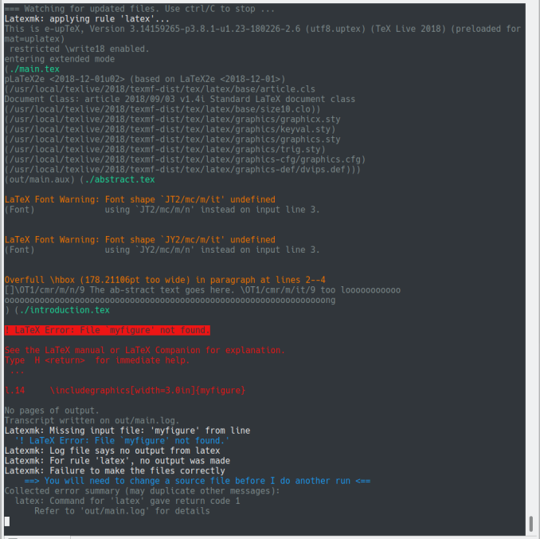

# :whale: akashisn/latexmk

Original author: https://github.com/arkark/latexmk-docker

[](https://github.com/AkashiSN/latexmk-docker/actions/workflows/latexmk.yml)

[](https://hub.docker.com/r/akashisn/latexmk)

Useful LaTeX environment on Docker.

- **One command** to LaTeX environment
- Colored latexmk output
- Automatic conversion from `、` `。` to `，` `．`



## Installation

```console
$ docker pull akashisn/latexmk
```

- Docker image size: **2.12GB**

If you want to install all packages of TeX Live, pull `akashisn/latexmk:full` whose size is 4.36GB :warning:.

## Usage

1. Prepare `main.tex` and some necessary files: e.g., other `*.tex` files, `*.bib` files, and image files.
2. Move to the directory.
3. Execute:
    ```console
    $ docker run --rm -it -v $PWD:/workdir -e USER_ID=$(id -u) -e GROUP_ID=$(id -g) akashisn/latexmk
    ```
    If you use Mac, execute:
    ```console
    $ docker run --rm -it -v $PWD:/workdir akashisn/latexmk
    ```
    If you use Windows, execute in PowerShell:
    ```console
    > docker run --rm -it -v "$(pwd):/workdir" akashisn/latexmk
    ```
4. Edit latex files and preview `out/main.pdf` while monitoring a latexmk's log.
5. Press `Ctrl+C` to exit.

## Options

The default latexmk file is [here](.latexmkrc), which uses uplatex.
If you want to customize it, add `.latexmkrc` file to the working directory.

For example, add the following `.latexmkrc` when using lualatex:

```perl
#!/usr/bin/env perl
$pdflatex = "lualatex --synctex=1 --interaction=nonstopmode --halt-on-error %O %S";
$max_repeat       = 5;
$pdf_mode         = 1;
$pdf_previewer    = ":";
$out_dir          = "out";
$pvc_view_file_via_temporary = 0;
```

## Advanced Usage

Latexdiff:

```console
$ docker run --rm -it -v $PWD:/workdir -e USER_ID=$(id -u) -e GROUP_ID=$(id -g) akashisn/latexmk latexdiff-vc <ARGS>
```

Colored latexmk with a root filename:

```console
$ docker run --rm -it -v $PWD:/workdir -e USER_ID=$(id -u) -e GROUP_ID=$(id -g) akashisn/latexmk latexmk-ext <FILE_NAME>
```

## Links

- [Dockerで動くいい感じのLaTeX環境をつくった話 | Ark's Blog](https://ark4rk.hatenablog.com/entry/2019/02/10/215152)
